Telegram: @wake_and_bake

# Dataset for RF-DETR must be in COCO-format:
```
dataset/
│
├── train/
│   ├── img1.jpg
│   ├── img2.jpg
│   ├── ...
│   └── _annotations.coco.json
│
├── val/
│   ├── img1.jpg
│   ├── ...
│   └── _annotations.coco.json 
│
└── test/          
    ├── img1.jpg
    ├── ...
    └── _annotations.coco.json
```

## Images from dataset:

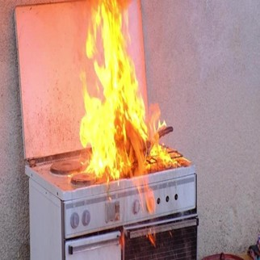
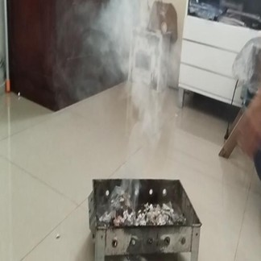
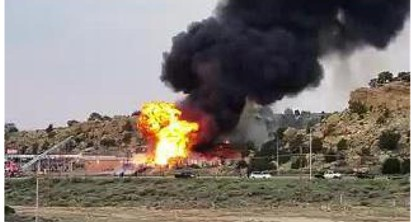

# Training results
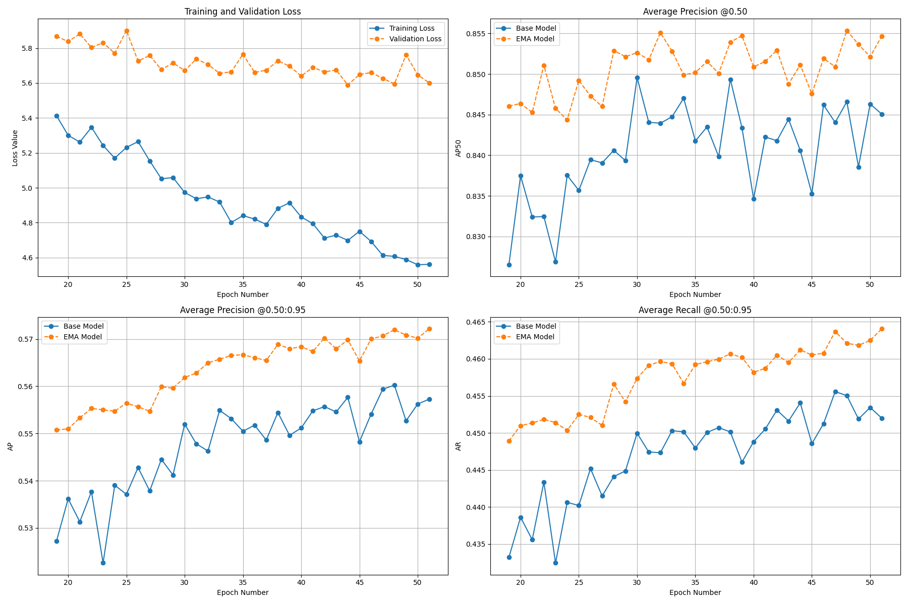
* map95: 0.572
* map50: 0.855

On the left is an image with annotations, on the right is the model's detection:
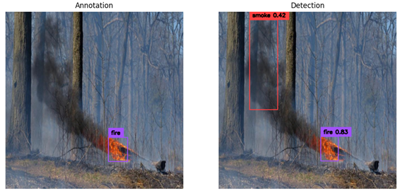

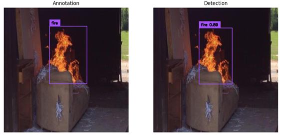

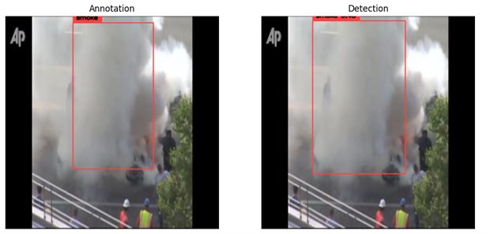

The main issue was the model's false detection of objects with red light hues—such as emergency lights, headlights, streetlights, and other similar sources—as fire:

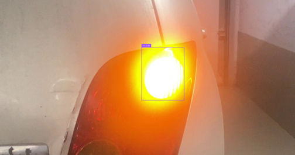

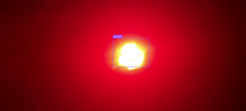

To address this,  I implemented a transformer-based module that analyzes temporal dynamics across frame sequences. This upgrade significantly improved the model’s ability to distinguish real fire from visual artifacts.

# Custom dataset for transformer:
```
dataset/
│
├── train/
│   ├── annotations.json
│   ├── ...
│   └──  seq_i/
│        ├── frame_000.jpg
│        ├── ...
│        └── frame_029.jpg
│
└── test/          
    ├── annotations.json
    ├── ...
    └── seq_i/
        ├── frame_000.jpg
        ├── ...
        └── frame_029.jpg
```

## Sequences from transformer dataset:
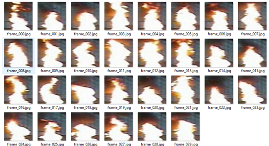

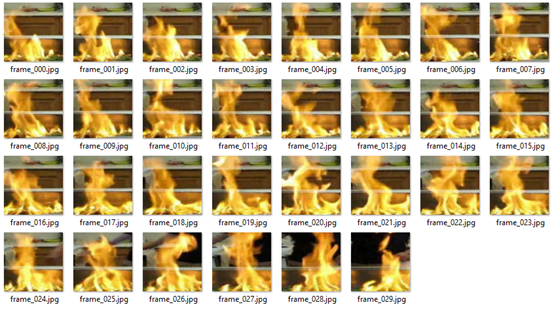

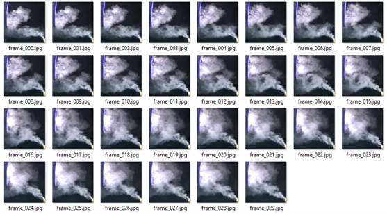

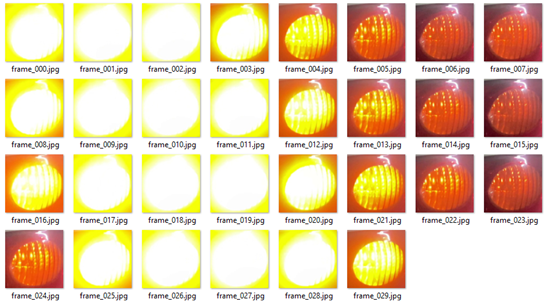

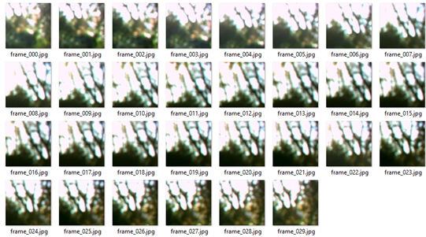

# Training transformer results:
	* Test accuracy: 97,3%; 
	* Test loss: 0,036;
	* Precision: 0,941; 
	* Recall: 1; 
	* F1 score: 0,969.

# Results
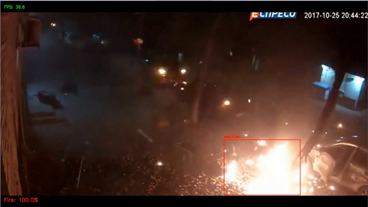

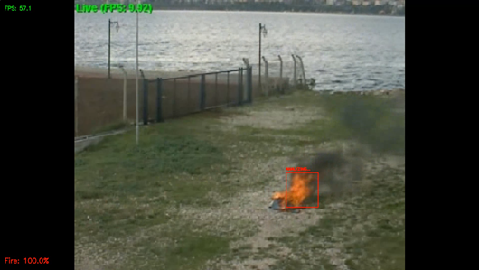

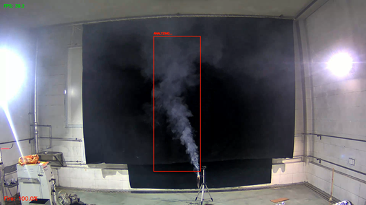

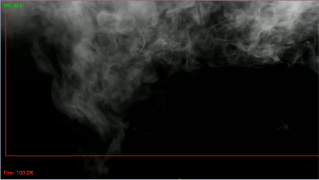

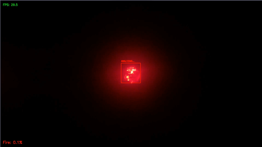

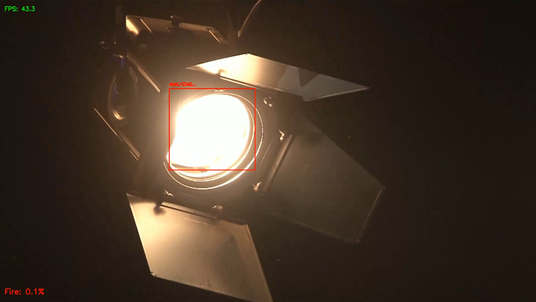

